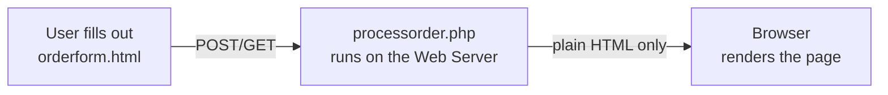
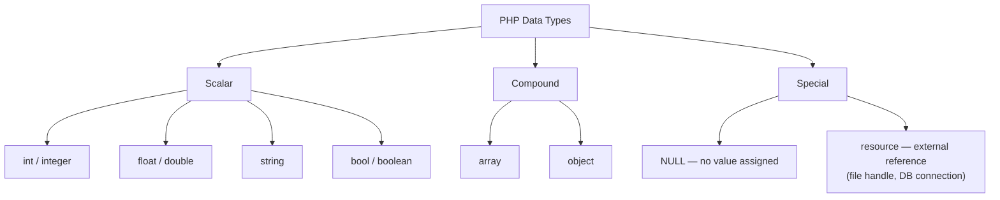
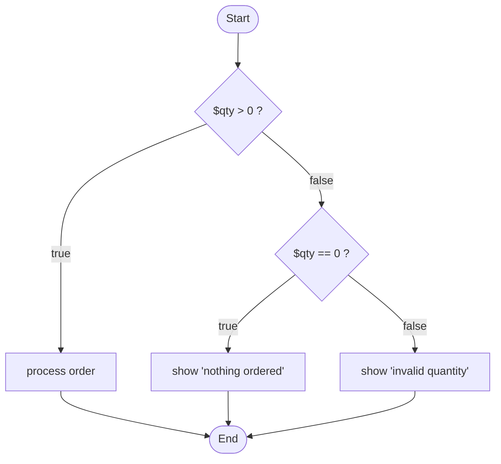
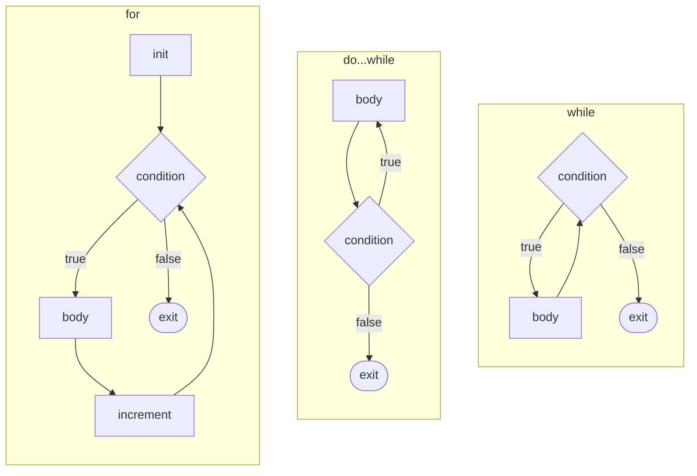
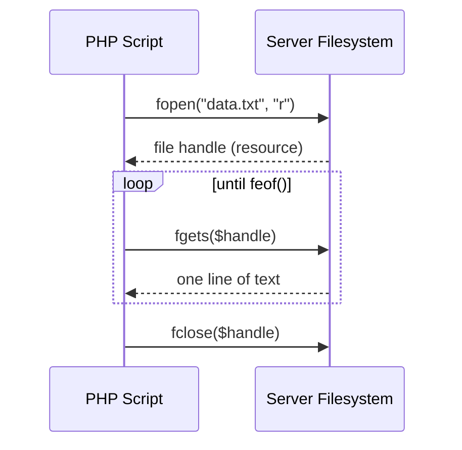
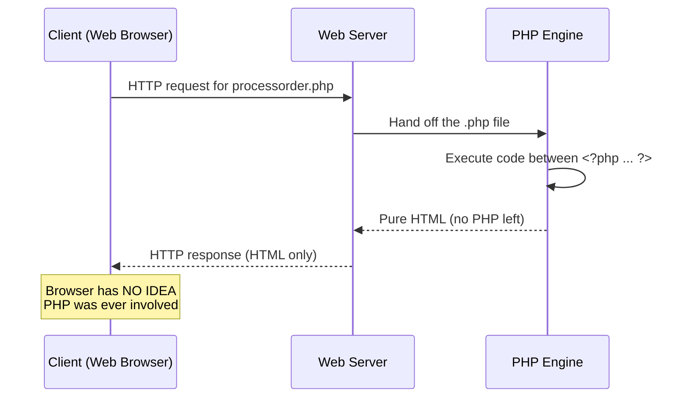

# PHP Crash Course
### ICS 325 – Internet Application Development
*A companion guide to the "Bob's Auto Parts" lecture deck — Siva R. Jasthi*

<p align="center">
  
</p>

---

## Table of Contents

1. [Data Types](#1-data-types)
2. [Operators — Arithmetic, Assignment, Comparison](#2-operators)
3. [Conditions](#3-conditions)
4. [Loops](#4-loops)
5. [Functions](#5-functions)
6. [File I/O](#6-file-io)
7. [Philosophy of PHP — Why "Server-Side"?](#7-philosophy-of-php)

---

Before diving in, remember the one-line mental model from the course deck's Bob's Auto Parts example: an HTML form (`orderform.html`) collects data, submits it to a `.php` file (`processorder.php`), and PHP — running **on the server** — reads that data, computes something, and hands plain HTML back to the browser. Everything below is in service of that loop.



---

## 1. Data Types

PHP is a **loosely / weakly / dynamically typed** language — you never declare a type up front. PHP figures out the type from the value and can even change a variable's type mid-script.

```php
<?php
$x = 5;          // integer
$y = 4;
echo $x + $y;     // 9

$x = "php";       // now $x is a string — totally legal
echo $x . " v5";  // "php v5"
?>
```

### The type map



| Category | Type | Example |
|---|---|---|
| Scalar | `int` | `$qty = 4;` |
| Scalar | `float` | `$price = 19.99;` |
| Scalar | `string` | `$name = "Bob's Auto Parts";` |
| Scalar | `bool` | `$inStock = true;` |
| Compound | `array` | `$parts = ["tire", "oil", "spark plug"];` |
| Compound | `object` | `$car = new Vehicle();` |
| Special | `NULL` | `$discount = null;` |
| Special | `resource` | `$fh = fopen("log.txt", "r");` |

### Type casting & type testing

```php
<?php
$str  = "42";
$num  = (int) $str;      // cast: 42

var_dump(is_int($num));     // bool(true)
var_dump(is_string($str));  // bool(true)
echo gettype($price);       // "double"
settype($price, "integer"); // force $price to int
?>
```

**Caution (from the deck):** variable names are **case-sensitive** (`$tireqty` ≠ `$TireQty`), but function names are **not** (`echo()`, `Echo()`, and `eChO()` are the same call).

---

## 2. Operators

### Arithmetic operators

| Operator | Meaning | Example |
|---|---|---|
| `+` | Addition | `$a + $b` |
| `-` | Subtraction | `$a - $b` |
| `*` | Multiplication | `$a * $b` |
| `/` | Division | `$a / $b` |
| `%` | Modulus (remainder) | `$a % $b` |
| `**` | Exponentiation | `$a ** $b` |

### Assignment & combined assignment

| Operator | Equivalent to |
|---|---|
| `$a = 5` | plain assignment |
| `$a += 5` | `$a = $a + 5` |
| `$a -= 5` | `$a = $a - 5` |
| `$a *= 5` | `$a = $a * 5` |
| `$a /= 5` | `$a = $a / 5` |
| `$a .= "x"` | `$a = $a . "x"` (string concatenation) |

The **dot operator `.`** is PHP's string concatenation operator — it's used constantly:

```php
<?php
$first = "Bob's";
$second = "Auto Parts";
echo $first . " " . $second;   // "Bob's Auto Parts"

// Double quotes interpolate variables directly (slightly slower):
echo "$first $second";         // same result

// Single quotes never interpolate — treated as a literal string:
echo 'Total: $first';          // prints literally "Total: $first"
?>
```

### Comparison operators

| Operator | Meaning |
|---|---|
| `==` | Equal (value only) |
| `===` | Identical (value **and** type) |
| `!=` / `<>` | Not equal |
| `!==` | Not identical |
| `<` `>` `<=` `>=` | Less/greater than (or equal) |

> **Classic logical error (straight from the deck):** `=` is assignment, `==` is comparison.
> `if ($a = 7)` silently *assigns* 7 to `$a` and is always truthy — not what you meant.
> **Tip:** write `if (7 == $a)` — if you typo the `=`, PHP throws a fatal error instead of a silent bug, because you can't assign to a literal.

### Logical operators

| Operator | Meaning |
|---|---|
| `&&` / `and` | AND |
| `\|\|` / `or` | OR |
| `!` | NOT |

---

## 3. Conditions

PHP branches with `if`, `if / else`, `if / elseif`, and `switch`.



```php
<?php
if ($qty > 0) {
    echo "Processing order...";
} elseif ($qty == 0) {
    echo "Nothing ordered.";
} else {
    echo "Invalid quantity.";
}
?>
```

`switch` branches on **any scalar value**, not just true/false, which makes it a good fit when you're comparing one variable against several fixed values:

```php
<?php
switch ($tireqty) {
    case 0:
        echo "No tires selected.";
        break;
    case 4:
        echo "Standard set.";
        break;
    default:
        echo "Custom quantity: $tireqty";
        break;
}
?>
```

Don't forget `break;` — without it, execution "falls through" into the next case.

---

## 4. Loops

PHP has three classic iteration constructs, plus `foreach` for arrays.



```php
<?php
// while: check the condition BEFORE each pass
$i = 1;
while ($i <= 5) {
    echo $i;
    $i++;
}

// do...while: runs the body at least ONCE, checks AFTER
$i = 1;
do {
    echo $i;
    $i++;
} while ($i <= 5);

// for: init; condition; increment — all in one line
for ($i = 1; $i <= 5; $i++) {
    echo $i;
}

// foreach: built for walking arrays
$parts = ["tire", "oil", "spark plug"];
foreach ($parts as $item) {
    echo $item . "\n";
}
?>
```

### Breaking out

| Keyword | Effect |
|---|---|
| `break` | Exit the loop immediately, resume after it |
| `continue` | Skip the rest of this pass, jump to the next iteration |
| `exit` (or `die`) | Stop the **entire script**, not just the loop |

---

## 5. Functions

Functions bundle reusable logic. PHP function names are **not** case-sensitive (unlike variables).

```php
<?php
function calculateTotal($qty, $price) {
    $total = $qty * $price;
    return $total;
}

echo calculateTotal(4, 19.99);   // 79.96

// Default parameter values
function greet($name = "Guest") {
    return "Hello, $name!";
}
echo greet();          // "Hello, Guest!"
echo greet("Bob");     // "Hello, Bob!"
?>
```

### Variable scope

This directly extends the scope rules from the deck:

| Scope | Behavior |
|---|---|
| **Global** | Declared outside any function; **not** automatically visible inside one |
| **Global (via keyword)** | Use `global $varname;` inside a function to reach an outer global variable |
| **Local** | Declared inside a function; destroyed once the function returns |
| **Static** | `static $count = 0;` inside a function — keeps its value **between calls**, but still invisible outside the function |
| **Superglobal** | `$_GET`, `$_POST`, `$_REQUEST`, `$_SESSION`, etc. — visible everywhere, no `global` keyword needed |

```php
<?php
function counter() {
    static $count = 0;   // remembers value across calls
    $count++;
    return $count;
}
echo counter(); // 1
echo counter(); // 2
echo counter(); // 3
?>
```

---

## 6. File I/O

Reading and writing files on the **server's** filesystem — a natural next step once you're comfortable with variables and functions.



```php
<?php
// --- Reading, line by line ---
$handle = fopen("data.txt", "r");
if ($handle) {
    while (!feof($handle)) {
        $line = fgets($handle);
        echo $line;
    }
    fclose($handle);
}

// --- Reading the whole file at once ---
$contents = file_get_contents("data.txt");

// --- Writing / appending ---
$handle = fopen("log.txt", "a");   // "a" = append, "w" = overwrite
fwrite($handle, "New entry: " . date("Y-m-d H:i:s") . "\n");
fclose($handle);

// --- Shorthand write (opens + writes + closes in one call) ---
file_put_contents("log.txt", "Quick note\n", FILE_APPEND);
?>
```

| Mode | Meaning |
|---|---|
| `"r"` | Read only, pointer at start |
| `"w"` | Write only, **truncates** existing file |
| `"a"` | Write only, appends to end |
| `"r+"` | Read and write, pointer at start |
| `"x"` | Create new file for writing; fails if it already exists |

**Always check that `fopen()` succeeded and always `fclose()`** — an open file handle is a `resource` type, and leaving it open wastes server resources.

---

## 7. Philosophy of PHP

### Why is PHP called a "server-side" language?

This is the single most important mental model from the whole course, straight from the deck's "What happens on the server side?" slide:



Key ideas:

- **PHP runs entirely on the web server**, before anything is sent to the browser. `<?php ... ?>` tags mark where PHP code starts and stops; everything outside those tags is plain HTML that passes through untouched.
- **By the time the response reaches the browser, every trace of PHP is gone** — only HTML remains. If a user does "View Source" in their browser, they will never see PHP code, variables, or logic — just the final rendered HTML.
- **The client doesn't need to know PHP exists.** This is fundamentally different from a *client-side* technology like JavaScript, where the browser itself must understand and execute the code.
- This is also why PHP is well suited to things a browser should never be trusted with: talking to a database, validating sensitive business logic, reading/writing server files (Section 6), or keeping API keys secret.

| | Server-side (PHP) | Client-side (JavaScript) |
|---|---|---|
| Executes on | The web server | The user's browser |
| Visible to user via "View Source"? | No — only its HTML output | Yes — the code itself |
| Needs browser support? | No | Yes |
| Typical uses | DB access, form processing, auth, file I/O | UI interactivity, animations, client validation |

### Wrapping up

1. PHP is **loosely / weakly / dynamically typed**.
2. Most control-flow constructs (`if`, `for`, `while`, `switch`) look and behave like Java or C.
3. Know your **data types, operators, scope rules, conditions, and loops** cold — they're the building blocks for everything else in this course.
4. Never forget: **`$`** in front of variables, and **`;`** at the end of every statement.
5. And above all — PHP's magic is that it does its work *before* the browser ever sees it.
